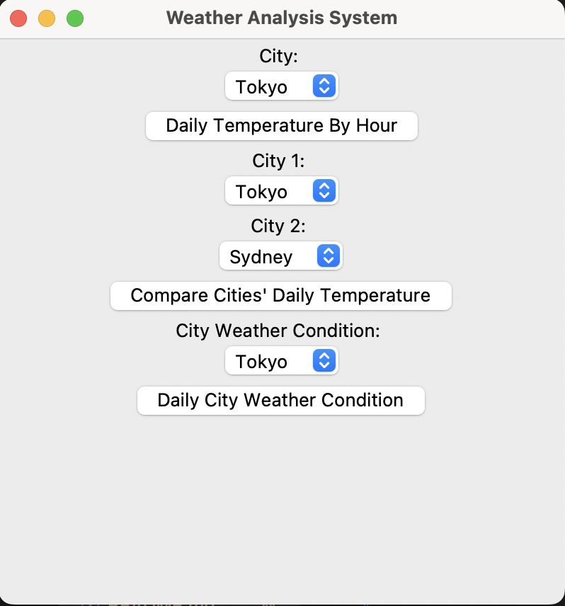
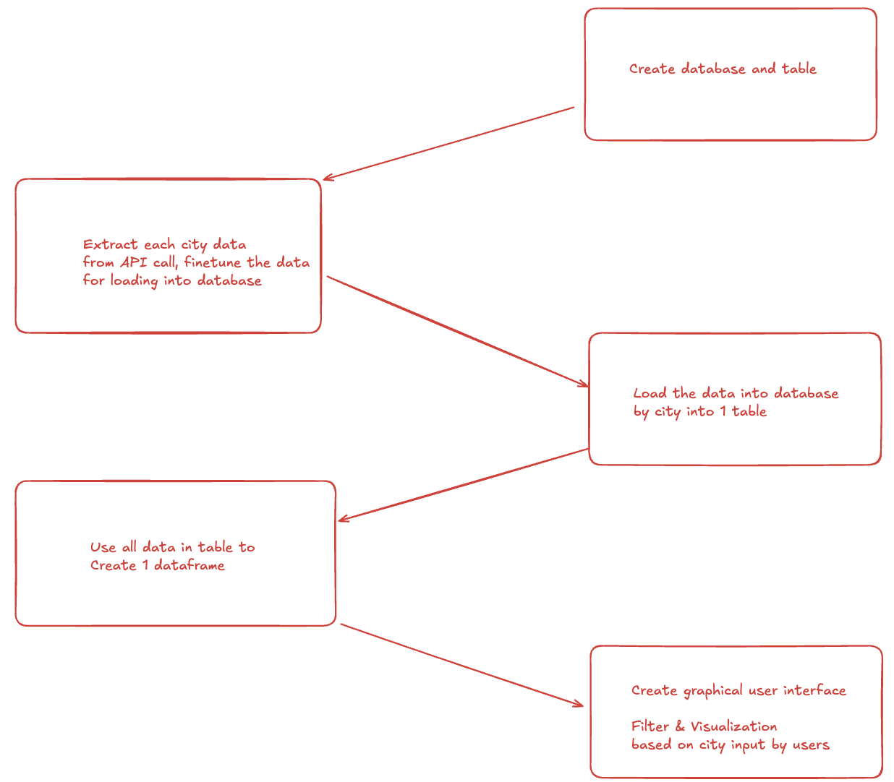

# Weather Data Analysis


# Table of Contents

- [About](#-about)
- [Output](#-output)
- [How to Build](#-how-to-build)
- [Contact](#-contact)

# 📚 About
This is a weather data analysis, which fetch the real-time weather data from openweathermap api. User could get regional weather analysis by simply clicking the buttons in graphical user interface.

# 💡 Output
## Graphical User Interface (GUI)


## Sample Output


# 📝 How to Build
## Workflow


### 1. Create database and table

```python
# Define a database and table

import requests
import schedule
import time
from datetime import datetime
import sqlite3

def create_table():
    conn = sqlite3.connect("weather_database.db")
    cursor = conn.cursor()
    cursor.execute('''
    CREATE TABLE IF NOT EXISTS weathers (
        id INTEGER PRIMARY KEY AUTOINCREMENT,
        city TEXT NOT NULL,
        date DATE NOT NULL,
        year INTEGER NOT NULL,
        month INTEGER NOT NULL,
        day INTEGER NOT NULL,
        hour INTEGER NOT NULL,
        minute INTEGER NOT NULL,
        second INTEGER NOT NULL,
        microsecond INTEGER NOT NULL,
        temperature NUMERIC(4,2),
        humidity INTEGER NOT NULL,
        weather TEXT NOT NULL
    )
    '''
    )
    conn.commit()
    conn.close()
```

### 2. Extract each city data from API call

```python
# Fetch data into database with finetuned column

def fetch_weather_data():
    create_table()
    for city in city_list:
        API_URL = f'http://api.openweathermap.org/data/2.5/weather?q={city}&appid={API_KEY}&units=metric'
        response = requests.get(API_URL) 
        if response.status_code == 200:
            data = response.json()
            timestamp = datetime.now()
            date_string = timestamp.strftime('%Y-%m-%d')
            raw_weather_data = {
                'city' : data['name'],
                'date' : date_string,
                'year': timestamp.year,
                'month': timestamp.month,
                'day': timestamp.day,
                'hour': timestamp.hour,
                'minute': timestamp.minute,
                'second': timestamp.second,
                'microsecond': timestamp.microsecond,
                'temperature': data['main']['temp'],
                'humidity': data['main']['humidity'],
                'weather': data['weather'][0]['description'],
            }

            print("-----------------------",raw_weather_data)

            # Insert data into database
            conn = sqlite3.connect('weather_database.db')
            cursor = conn.cursor()
            cursor.execute('''INSERT INTO weathers 
            (city, date, year, month, day, hour, minute, second, microsecond, temperature, humidity, weather) 
            VALUES (?, ?, ?, ?, ?, ?, ?, ?, ?, ?, ?, ?)''',
            (data['name'], date_string, timestamp.year, timestamp.month, timestamp.day, timestamp.hour, timestamp.minute, timestamp.second, timestamp.microsecond, data['main']['temp'], data['main']['humidity'], data['weather'][0]['description']))
            conn.commit()
            conn.close()
        else:
            print(f"Failed to fetch data for {city}") 
```

```python
# Define scheduler to fetch data

def run_scheduler():
    # Set it as 1 for thread later
    interval = 1

    schedule.every(interval).minutes.do(fetch_weather_data)
    
    print(f"Scheduler started. Fetching weather data every {interval} minute(s).")
    
    while True:
        schedule.run_pending()
        time.sleep(1)

if __name__ == "__main__":
    run_scheduler()
```

### 3. Define GUI functions
```python
import sqlite3
import matplotlib.pyplot as plt
import matplotlib.dates as md
import tkinter as tk
# from tkinter import messagebox, simpledialog
# from tkinter.scrolledtext import ScrolledText
import pandas as pd

# Available cities
city_list = ["Tokyo, JP","Sydney, AU",
            "Paris, FR","Berlin, DE","Moscow, RU",
            "Beijing, CN","Singapore, SG","Seoul, KR","Bangkok, TH","Toronto, CA","Shanghai, CN","Chicago, US"
    ]

# Extract cities' names
amended_city_list = []
for city in city_list:
    amend_city = city.split(",")[0]
    amended_city_list.append(amend_city)

# Define GUI functions, which include functions of button and GUI initializing

def run_gui():
    def time_series_visualization_daily_simple_plot(city):
        conn = sqlite3.connect('weather_database.db')
        df = pd.read_sql_query(f"SELECT * FROM weathers WHERE city = '{city}' AND day = 29", conn) # date = DATE('now')
        df['date_time'] = pd.to_datetime(df['date'] + ' ' + df['hour'].astype(str) + ':' + df['minute'].astype(str), format='%Y-%m-%d %H:%M') # this code is for feeding data locally, it based on local timezone
        fig, ax = plt.subplots()
        ax.xaxis.set_major_locator(md.MinuteLocator(byminute=[0, 30]))
        ax.xaxis.set_major_formatter(md.DateFormatter('%H:%M'))
        plt.plot(df['date_time'], df['temperature'])
        plt.title('Daily Temperature By Hour')
        plt.xlabel('Time')
        plt.ylabel('Temperature')
        plt.xticks(rotation = 45)
        plt.tight_layout()
        plt.show()

    def city_compare_analysis_daily_temperature(city_1, city_2):
        conn = sqlite3.connect('weather_database.db')
        df_city_1 = pd.read_sql_query(f"SELECT * FROM weathers WHERE city = '{city_1}' AND day = 29", conn) # date = DATE('now')
        df_city_2 = pd.read_sql_query(f"SELECT * FROM weathers WHERE city = '{city_2}' AND day = 29", conn) # date = DATE('now')
        df_city_1['date_time'] = pd.to_datetime(df_city_1['date'] + ' ' + df_city_1['hour'].astype(str) + ':' + df_city_1['minute'].astype(str), format='%Y-%m-%d %H:%M')
        df_city_2['date_time'] = pd.to_datetime(df_city_2['date'] + ' ' + df_city_2['hour'].astype(str) + ':' + df_city_2['minute'].astype(str), format='%Y-%m-%d %H:%M')
        conn.close()
        fig, ax = plt.subplots()
        ax.xaxis.set_major_locator(md.MinuteLocator(byminute=[0, 30]))
        ax.xaxis.set_major_formatter(md.DateFormatter('%Y-%m-%d %H:%M'))
        plt.plot(df_city_1['date_time'], df_city_1['temperature'], label=city_1)
        plt.plot(df_city_2['date_time'], df_city_2['temperature'], label=city_2)
        plt.title('Temperature Comparison')
        plt.xlabel('Date')
        plt.ylabel('Temperature')
        plt.xticks(rotation = 45)
        plt.legend()
        plt.tight_layout()
        plt.show()

    def city_daily_weather_situation(city_weather):
        conn = sqlite3.connect('weather_database.db')
        df_city_3 = pd.read_sql_query(f'''SELECT *, COUNT(weather) AS weather_minute, ROUND(COUNT(weather)/60.0, 1) AS weather_hour
                                          FROM weathers 
                                          WHERE city = 'Tokyo' AND day = 29
                                          GROUP BY weather''', conn) # date = DATE('now')
        conn.close()
        plt.bar(df_city_3['weather'], df_city_3['weather_hour'])
        plt.title('Daily Weather Condition By Minutes')
        plt.xlabel('Weather')
        plt.ylabel('Hour')
        plt.xticks(rotation = 20)
        plt.tight_layout()
        plt.show()
```

### 4. GUI
```python
# Create interface with tkinter
    root = tk.Tk()
    root.title("Weather Analysis System")
    root.geometry("400x400")

    city_label = tk.Label(root, text = "City: ")
    city_1_label = tk.Label(root, text = "City 1: ")
    city_2_label = tk.Label(root, text = "City 2: ")
    city_weather_label = tk.Label(root, text = "City Weather Condition: ")

    selected_city = tk.StringVar()
    selected_city_1 = tk.StringVar()
    selected_city_2 = tk.StringVar()
    selected_city_weather = tk.StringVar()

    selected_city.set(amended_city_list[0])
    selected_city_1.set(amended_city_list[0])
    selected_city_2.set(amended_city_list[1])
    selected_city_weather.set(amended_city_list[0])

    dropdown_city = tk.OptionMenu(root, selected_city, *amended_city_list)
    dropdown_city_1 = tk.OptionMenu(root, selected_city_1, *amended_city_list)
    dropdown_city_2 = tk.OptionMenu(root, selected_city_2, *amended_city_list)
    dropdown_city_weather = tk.OptionMenu(root, selected_city_weather, *amended_city_list)

    compare_button = tk.Button(root, text="Compare Cities' Daily Temperature", command = lambda : city_compare_analysis_daily_temperature(selected_city_1.get(), selected_city_2.get()))
    simple_plot_button = tk.Button(root, text = 'Daily Temperature By Hour', command = lambda : time_series_visualization_daily_simple_plot(selected_city.get()))
    city_weather_button = tk.Button(root, text = 'Daily City Weather Condition', command = lambda : city_daily_weather_situation(selected_city_weather.get()))

# Place widgets in the GUI
    city_label.pack()
    dropdown_city.pack()
    simple_plot_button.pack()
    city_1_label.pack()
    dropdown_city_1.pack()
    city_2_label.pack()
    dropdown_city_2.pack()
    compare_button.pack()
    city_weather_label.pack()
    dropdown_city_weather.pack()
    city_weather_button.pack()

    root.mainloop()

# Only run if the file name is the MAIN file in the terminal
if __name__ == "__main__":
    run_gui()
```

### 5. Fetch data and get visualization at the same time
```python
from gui import run_gui
from scheduler import run_scheduler
import threading

# Use Thread to ensure two python files could run simultaneously
scheduler_thread = threading.Thread(target=run_scheduler)

scheduler_thread.start()

run_gui()
```

# 📧 Contact
If you're interested in my project, please feel free to contact me through email, my email is kevincyhei@gmail.com.
